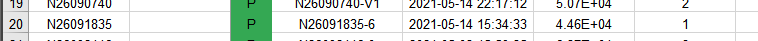

# DSAI_HW3

## idea
The idea behind this homework is really simple. But instead of present our idea straight away, I would like to talk about the ideal working flow. Ideally, we should use consume and generating power data as our input to determine the sell or buy power value. Also, using the bidresult data as our bidding price reference to train a proper model. Note, these are the "ideal" strategy. But in reality, thing doesn't always play like that. The game spirit in the marketing is to uderstand the game rule and play a nice hand. So, in the end, we decide not to use model to make a prediction. The bidding rule is when we sell under the market price than the system will use the market price as my sell price. In the other way, I can earn the profit between my price and the market price. Buy strategy is the opposite way. When we buy higher than the market price, the system will use market price to buy. Finally, our strategy is to lower the price as much as we can and we buy as high as we can. We also fixed our power value as 1. This way we just make sure that we can buy or sell every deal or most of the deal than we still make amount of profit. Here is a bidding result capture of our team ranking that we use sell low and buy high strategy.

Bidding result, as you can see, we ell low and buy high and we make sure we get most of the deal.

Ranking, this is our highes ranking

